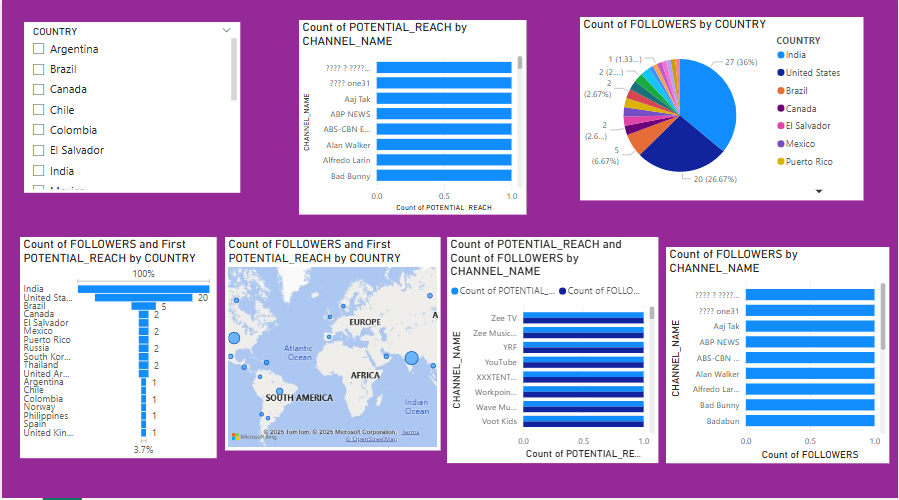

# 📊 YouTube Data Analysis  

## 📌 Overview
This project analyzes YouTube influencers in the U.S., focusing on **followers, potential reach, and engagement trends**. The dataset is cleaned, explored, and visualized using **SQL, Jupyter Notebook, and Power BI**. An interactive dashboard is included to showcase insights.  

## 🎯 Objective
The goal of this project is to **analyze trends in YouTube channel growth, predict future performance, and explore regional influences on audience engagement.** It provides insights into **factors contributing to a YouTube channel’s success** and **how engagement varies across different creators.**  

## 🚀 Features
- **Data Cleaning & Preprocessing**: Handles missing values and removes outliers using SQL.
- **Exploratory Data Analysis (EDA)**: Visualizes key patterns in **follower count, engagement, and country-wise distribution**.
- **Top YouTube Influencers**: Identifies the **most followed creators**.
- **Dashboard**: An **interactive visualization** of key insights in **Power BI**.

## 📊 Key Insights
- **Correlation Analysis**: Relationship between followers and potential reach.  
- **Top 10 YouTubers**: Breakdown of the most followed creators.  
- **Country-wise Distribution**: Understanding audience reach per region.  

## 🛠️ Technologies Used
-  **SQL** (Data cleaning & transformation)  
- **Jupyter Notebook** (Data analysis & visualization)  
- **Power BI** (Dashboard & insights visualization)

## ⚡ How to Use    
1. Clone the repository:  
   ```bash
   git clone https://github.com/Rejjy_emerald/Top_US_Youtubers.git
   cd Top_US_Youtubers

## 📈 Dashboard Preview


## 🔮 Future Enhancements
- Automate Data Updates using YouTube API.
- Sentiment Analysis on YouTube comments to understand audience reactions.
- Predictive Analytics to forecast follower growth using machine learning.

## 🤝 Contributing
Contributions are welcome! If you'd like to improve this project, feel free to fork the repository and submit a pull request.

## 📜 License
This project is open-source under the MIT License.

